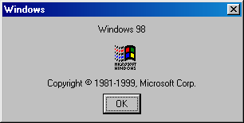

    

# winver9x
winver9x is a Win32 recreation of the `WINVER.EXE` applet from Windows 9x, the original version of which is
a Win16 application and will not run on modern systems.

## Building
For most people, just building the winver9x project will be enough. However, if you want to run this on Windows
2000/Me and before, you will need to build and run the pepatcher project on a compiled x86 winver9x.exe.

## Configuration
winver9x can display different brandings. To do so, create the registry value
`HKEY_CURRENT_USER\SOFTWARE\winver9x\Mode` as a DWORD, and set it to one of
the following values:

- 0 - Windows 95, default
- 1 - Windows 98
- 2 - Windows 98 SE (1999 copyright date)